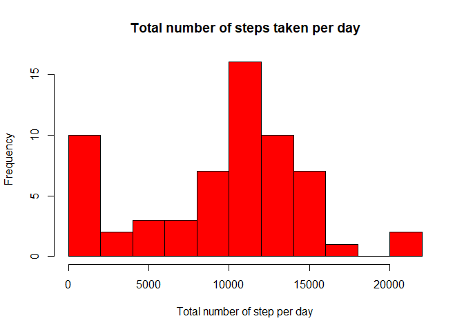
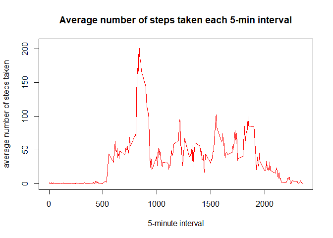
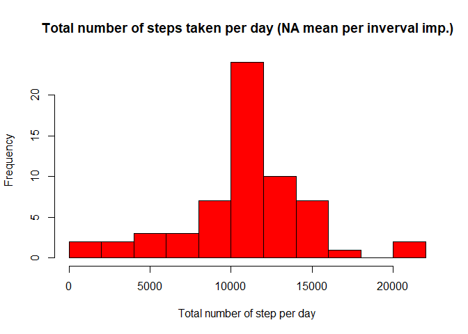
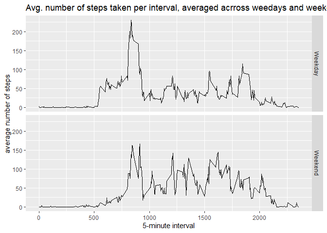

## Loading and preprocessing the data

```r
# Load the data
unzip("./activity.zip")
activity_data <- read.csv("./activity.csv")
```


## What is mean total number of steps taken per day?
For this part of the assignment, we ignore the missing values in the dataset. That is we use remove NA (on purpose).

```r
# Calculate the total number of steps taken per day
total_number_steps_per_day <- aggregate(activity_data$steps, by = list(activity_data$date), sum, na.rm = TRUE)
names(total_number_steps_per_day) <- c('date','steps')
# Make a histogram of the total number of steps taken each day
hist(total_number_steps_per_day$steps,xlab = "Total number of step per day", main = "Total number of steps taken per day", ylab = "Frequency", breaks = 10, col = "red")
```

<!-- -->

```r
#Calculate and report the mean and median of the total number of steps taken per day
mean(total_number_steps_per_day$steps)
```

```
## [1] 9354.23
```

```r
median(total_number_steps_per_day$steps)
```

```
## [1] 10395
```


## What is the average daily activity pattern?

```r
#Make a time series plot of the 5-minute interval (x-axis) and the average number of steps taken, averaged across all days (y-axis)
mean_number_steps_per_interval <-  aggregate(activity_data$steps, by = list(activity_data$interval), mean, na.rm = TRUE)
names(mean_number_steps_per_interval) <- c('interval','steps')
plot(mean_number_steps_per_interval$interval, mean_number_steps_per_interval$steps, type = 'l', xlab = "5-minute interval", main = "Average number of steps taken each 5-min interval", ylab = "average number of steps taken", col = "red")
```

<!-- -->

```r
# Which 5-minute interval, on average across all the days in the dataset, contains the maximum number of steps? 
mean_number_steps_per_interval$interval[which.max(mean_number_steps_per_interval$steps)]
```

```
## [1] 835
```


## Imputing missing values
Note that there are a number of days/intervals where there are missing values. The presence of missing days may introduce bias into some calculations or summaries of the data.


```r
# Calculate and report the total number of missing values in the dataset
sum(is.na(activity_data$steps))
```

```
## [1] 2304
```

```r
# Devise a strategy for filling in all of the missing values in the dataset. 
# We will use the mean for that 5-minute interval i.e. what is calculated in mean_number_steps_per_interval
# merge the datasets to make it easier to impute in next step
activity_data_w_mean_steps <- merge(activity_data,mean_number_steps_per_interval,by = "interval")
names(activity_data_w_mean_steps) <- c('interval','steps','date','mean_steps')
# Create a new dataset that is equal to the original dataset but with the missing data filled in
activity_data_w_mean_steps$steps <- ifelse(is.na(activity_data_w_mean_steps$steps),activity_data_w_mean_steps$mean_steps,activity_data_w_mean_steps$steps)
# create the new dataset with the variables we want to use
activity_data_ipmuted <- activity_data_w_mean_steps[,1:3]
activity_data_ipmuted <- activity_data_ipmuted[order(activity_data_ipmuted$date, activity_data_ipmuted$interval),]

# Make a histogram of the total number of steps taken each day
total_number_steps_per_day_imp <- aggregate(activity_data_ipmuted$steps, by = list(activity_data_ipmuted$date), sum, na.rm = TRUE)
names(total_number_steps_per_day_imp) <- c('date','steps')    
hist(total_number_steps_per_day_imp$steps,xlab = "Total number of step per day", main = "Total number of steps taken per day (NA mean per inverval imp.)", ylab = "Frequency", breaks = 10, col = "red")
```

<!-- -->

```r
#Calculate and report the mean and median of the total number of steps taken per day
mean(total_number_steps_per_day_imp$steps) 
```

```
## [1] 10766.19
```

```r
median(total_number_steps_per_day_imp$steps) 
```

```
## [1] 10766.19
```

```r
# Do these values differ from the estimates from the first part of the assignment? What is the impact of imputing missing data on the estimates of the total daily number of steps?

# Both mean and median have increased
# The mean is the same as the median as could have been expected
```


## Are there differences in activity patterns between weekdays and weekends?
For this part the weekdays() function may be of some help here. Use the dataset with the filled-in missing values for this part.


```r
# Create a new factor variable in the dataset with two levels – “weekday” and “weekend” indicating whether a given date is a weekday or weekend day.
# First we set date to date then we create the new factor variable
activity_data_ipmuted$date <- as.Date(activity_data_ipmuted$date)
activity_data_ipmuted$weedday <- ifelse(weekdays(activity_data_ipmuted$date) %in% c("Saturday","Sunday"),"Weekend","Weekday")
activity_data_ipmuted$weedday <- as.factor(activity_data_ipmuted$weedday)

# Make a panel plot containing a time series plot of the 5-minute interval (x-axis) and the average number of steps taken, averaged across all weekday days or weekend days (y-axis). 
# we use ggplot2 package to make the plot
library(ggplot2)

# First we create the data frame
mean_number_steps_per_interval_imp <- aggregate(activity_data_ipmuted$steps, by = list(activity_data_ipmuted$interval,activity_data_ipmuted$weedday), mean)
names(mean_number_steps_per_interval_imp) <- c('interval','weekday','steps')
# Then we make the plot
g <- ggplot(mean_number_steps_per_interval_imp,aes(interval,steps))
g + geom_line() + facet_grid(weekday~.)+ labs(x='5-minute interval', y='average number of steps') + labs(title = "Avg. number of steps taken per interval, averaged acrross weedays and weekends")
```

<!-- -->
